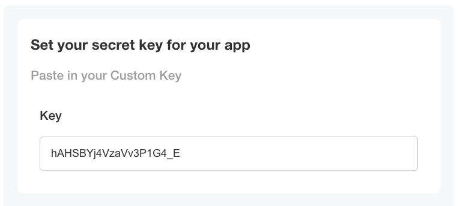

```yaml
- name: custom_key
  title: Set your secret key for your app
  description: Paste in your Custom Key
  items:
  - name: key
    title: Key
    type: text
    value: "{{repl RandomString 20}}"
```
