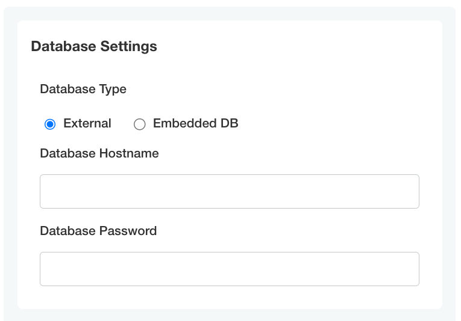
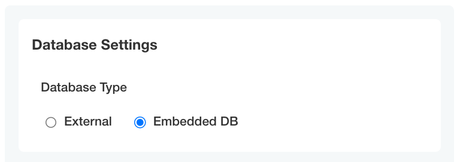

```yaml
- name: database_settings_group
  title: Database Settings
  items:
  - name: db_type
    title: Database Type
    type: select_one
    default: external
    items:
    - name: external
      title: External
    - name: embedded
      title: Embedded DB
  - name: database_host
    title: Database Hostname
    type: text
    when: '{{repl (ConfigOptionEquals "db_type" "external")}}'
  - name: database_password
    title: Database Password
    type: password
    when: '{{repl (ConfigOptionEquals "db_type" "external")}}'
```



