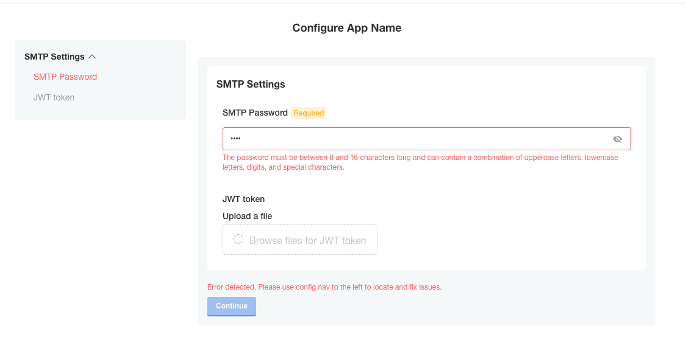
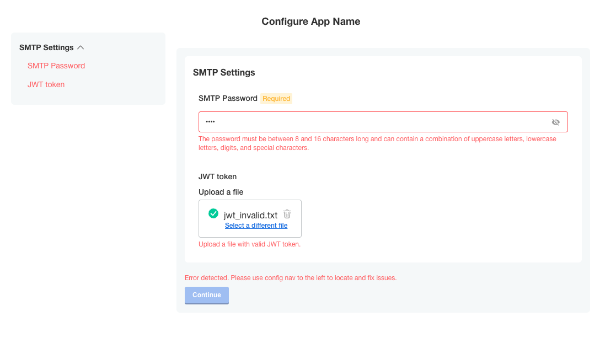

import ItemTypes from "../partials/config/_item-types.mdx"
import PropertyWhen from "../partials/config/_property-when.mdx"
import RandomStringNote from "../partials/config/_randomStringNote.mdx"
import NameExample from "../partials/config/_nameExample.mdx"
import TypeExample from "../partials/config/_typeExample.mdx" 
import DefaultExample from "../partials/config/_defaultExample.mdx" 
import ValueExample from "../partials/config/_valueExample.mdx" 
import RequiredExample from "../partials/config/_requiredExample.mdx" 
import RecommendedExample from "../partials/config/_recommendedExample.mdx" 
import HiddenExample from "../partials/config/_hiddenExample.mdx" 
import ReadonlyExample from "../partials/config/_readonlyExample.mdx" 
import WhenExample from "../partials/config/_whenExample.mdx" 
import AffixExample from "../partials/config/_affixExample.mdx" 
import HelpTextExample from "../partials/config/_helpTextExample.mdx"
import RegexValidationExample from "../partials/config/_regexValidationExample.mdx"

# Config

The Config custom resource can be provided by a vendor to specify a Config page in the Replicated admin console for collecting customer supplied values and template function rendering.

The settings that appear on the admin console Config page are specified as an array configuration _groups_ and _items_.

The following example shows three groups defined in the Config custom resource manifest file, and how these groups are displayed on the admin console Config page.

For more information about the properties of groups and items, see [Group Properties](#group-properties) and [Item Properties](#item-properties) below.

```yaml
spec:
  groups:
    - name: example_group
      title: First Group
      description: This is descriptive help text.
      items:
      - name: http_enabled
        title: HTTP Enabled
        type: bool
        default: "0"
    - name: example_group_2
      title: Second Group
      description: This is descriptive help text.
      when: false
      items:
      - name: key
        title: Key
        type: textarea
        props:
          rows: 8
      - name: hostname
        title: Hostname
        type: text  
    - name: example_group_3
      title: Third Group
      description: This is descriptive help text.
      items:
      - name: email-address
        title: Email Address
        type: text  
      - name: password_text
        title: Password
        type: password
        value: "{{repl RandomString 10}}"     
```

[View a larger version of this image](/images/config-screen-groups.png)

## Group Properties

Groups have a `name`, `title`, `description` and an array of `items`.

### `description`

Descriptive help text for the group that displays on the admin console Config page. Supports markdown formatting.

To provide help text for individual items on the Config page, use the item `help-text` property. See [help_text](#help_text) below.

```yaml
spec:
  groups:
    - name: example_group
      title: First Group
      # Provide a description of the input fields in the group
      description: Select whether or not to enable HTTP.
      items:
      - name: http_enabled
        title: HTTP Enabled
        type: bool
        default: "0"
```

### `name`

A unique identifier for the group.

```yaml
spec:
  groups:
    # The name must be unique
    - name: example_group
      title: First Group
      description: This is descriptive help text.
      items:
      - name: http_enabled
        title: HTTP Enabled
        type: bool
        default: "0"
```

### `title`

The title of the group that displays on the admin console Config page.

```yaml
spec:
  groups:
    - name: example_group
    # First Group is the heading that appears on the Config page
      title: First Group
      description: This is descriptive help text.
      items:
      - name: http_enabled
        title: HTTP Enabled
        type: bool
        default: "0"
```

### `when`

<PropertyWhen/>

```yaml
spec:
  groups:
    - name: example_group
      title: First Group
      description: This is descriptive help text.
      items:
      - name: http_enabled
        title: HTTP Enabled
        type: bool
        default: "0"
    - name: example_group_2
      title: Second Group
      description: This is descriptive help text.
      # The group is not displayed if when is false
      when: repl{{ ConfigOptionEquals "http_enabled" "1" }}
      items:
      - name: key
        title: Key
        type: textarea
        props:
          rows: 8
      - name: hostname
        title: Hostname
        type: text  
    - name: example_group_3
      title: Third Group
      description: This is descriptive help text.
      items:
      - name: email-address
        title: Email Address
        type: text  
      - name: password_text
        title: Password
        type: password
        value: "{{repl RandomString 10}}"     
```


[View a larger version of this image](/images/config-screen-group-when-false.png)

### `items`

Each group contains an array of items that map to input fields on the admin console Config screen. All items have `name`, `title`, and `type` properties and belong to a single group.

For more information, see [Item Properties](#item-properties) and [Item Types](#item-types) below.

## Item Properties

Items have a `name`, `title`, `type`, and other optional properties.

### `affix`

<table>
  <tr>
    <th>Description</th>
    <td>
      <p>Items can be affixed <code>left</code> or <code>right</code>. Affixing items allows them to appear in the admin console on the same line.<br></br><br></br>Specify the <code>affix</code> field to all of the items in a particular group to prevent the appearance of crowded text. </p>
    </td>
  </tr>
  <tr>
    <th>Required?</th>
    <td>No</td>
  </tr>
  <tr>
    <th>Example</th>
    <td><AffixExample/></td>
  </tr>
  <tr>
    <th>Supports Go templates?</th>
    <td>Yes</td>
  </tr>    
</table>

### `default`

<table>
  <tr>
    <th>Description</th>
    <td>
      <p>Defines the default value for the config item. If the user does not provide a value for the item, then the <code>default</code> value is applied.</p>
      <p>If the <code>default</code> value is not associated with a <code>password</code> type config item, then it appears as placeholder text in the admin console.</p>
    </td>
  </tr>
  <tr>
    <th>Required?</th>
    <td>No</td>
  </tr>
  <tr>
    <th>Example</th>
    <td><DefaultExample/></td>
  </tr>
  <tr>
    <th>Supports Go templates?</th>
    <td><p>Yes. Every time the user makes a change to their configuration settings for the application, any template functions used in the <code>default</code> property are reevaluated.</p></td>
  </tr>    
</table>

### `help_text`

<table>
  <tr>
    <th>Description</th>
    <td>
      <p>Displays a helpful message below the <code>title</code> for the config item in the admin console.</p>
      <p>Markdown syntax is supported. For more information about markdown syntax, see <a href="https://guides.github.com/features/mastering-markdown/">Basic writing and formatting syntax</a> in the GitHub Docs.</p>
    </td>
  </tr>
  <tr>
    <th>Required?</th>
    <td>No</td>
  </tr>
  <tr>
    <th>Example</th>
    <td><HelpTextExample/></td>
  </tr>
  <tr>
    <th>Supports Go templates?</th>
    <td>Yes</td>
  </tr>    
</table> 

### `hidden`

<table>
  <tr>
    <th>Description</th>
    <td>
       <p>Hidden items are not visible in the admin console.</p>
       <p><RandomStringNote/></p>
    </td>
  </tr>
  <tr>
    <th>Required?</th>
    <td>No</td>
  </tr>
  <tr>
    <th>Example</th>
    <td><HiddenExample/></td>
  </tr>
  <tr>
    <th>Supports Go templates?</th>
    <td>No</td>
  </tr>    
</table> 

### `name`

<table>
  <tr>
    <th>Description</th>
    <td>A unique identifier for the config item. Item names must be unique both within the group and across all groups. The item name is not displayed in the admin console.</td>
  </tr>
  <tr>
    <th>Required?</th>
    <td>Yes</td>
  </tr>
  <tr>
    <th>Example</th>
    <td><NameExample/></td>
  </tr>
  <tr>
    <th>Supports Go templates?</th>
    <td>Yes</td>
  </tr>    
</table>

### `readonly`

<table>
  <tr>
    <th>Description</th>
    <td>
      <p>Readonly items are displayed in the admin console and users cannot edit their value.</p>
      <p><RandomStringNote/></p>
    </td>
  </tr>
  <tr>
    <th>Required?</th>
    <td>No</td>
  </tr>
  <tr>
    <th>Example</th>
    <td><ReadonlyExample/></td>
  </tr>
  <tr>
    <th>Supports Go templates?</th>
    <td>No</td>
  </tr>    
</table> 

### `recommended`

<table>
  <tr>
    <th>Description</th>
    <td><p>Displays a Recommended tag for the config item in the admin console.</p>
    </td>
  </tr>
  <tr>
    <th>Required?</th>
    <td>No</td>
  </tr>
  <tr>
    <th>Example</th>
    <td>
      <RecommendedExample/>
    </td>
  </tr>
  <tr>
    <th>Supports Go templates?</th>
    <td>No</td>
  </tr>    
</table> 

### `required`

<table>
  <tr>
    <th>Description</th>
    <td><p>Displays a Required tag for the config item in the admin console. A required item prevents the application from starting until it has a value.</p>
    </td>
  </tr>
  <tr>
    <th>Required?</th>
    <td>No</td>
  </tr>
  <tr>
    <th>Example</th>
    <td><RequiredExample/></td>
  </tr>
  <tr>
    <th>Supports Go templates?</th>
    <td>No</td>
  </tr>    
</table> 

### `title`

<table>
  <tr>
    <th>Description</th>
    <td><p>The title of the config item that displays in the admin console.</p></td>
  </tr>
  <tr>
    <th>Required?</th>
    <td>Yes</td>
  </tr>
  <tr>
    <th>Example</th>
    <td><HelpTextExample/></td>
  </tr>
  <tr>
    <th>Supports Go templates?</th>
    <td>Yes</td>
  </tr>    
</table>

### `type`

<table>
  <tr>
    <th>Description</th>
    <td>
      <p>Each item has a <code>type</code> property that defines the type of user input accepted by the field.</p>
      <p>The <code>type</code> property supports the following values: <ItemTypes/>
      </p>
      <p>For information about each type, see <a href="#item-types">Item Types</a>.</p>
    </td>
  </tr>
  <tr>
    <th>Required?</th>
    <td>Yes</td>
  </tr>
  <tr>
    <th>Example</th>
    <td><TypeExample/></td>
  </tr>
  <tr>
    <th>Supports Go templates?</th>
    <td>No</td>
  </tr>    
</table>

### `value`

<table>
  <tr>
    <th>Description</th>
    <td>
      <p>Defines the value of the config item. Data that you add to <code>value</code> appears as the HTML input value for the config item in the admin console.</p>
      <p>If the config item is not readonly, then the data that you add to <code>value</code> is overwritten by any user input for the item. If the item is readonly, then the data that you add to <code>value</code> cannot be overwritten.</p>
    </td>
  </tr>
  <tr>
    <th>Required?</th>
    <td>No</td>
  </tr>
  <tr>
    <th>Example</th>
    <td><ValueExample/></td>
  </tr>
  <tr>
    <th>Supports Go templates?</th>
    <td><p>Yes</p><RandomStringNote/></td>
  </tr>    
</table>

### `when`

<table>
  <tr>
    <th>Description</th>
    <td><p><PropertyWhen/></p></td>
  </tr>
  <tr>
    <th>Required?</th>
    <td>No</td>
  </tr>
  <tr>
    <th>Example</th>
    <td>
      <p>Display the <code>database_host</code> and <code>database_password</code> items only when the user <br/> selects <code>external</code> for the <code>db_type</code> item:</p>
      <WhenExample/>
    </td>
  </tr>
  <tr>
    <th>Supports Go templates?</th>
    <td>Yes</td>
  </tr>    
</table>

### `validation`

<table>
  <tr>
    <th>Description</th>
    <td><p>The <code>validation</code> property can be used to validate an item's value, <br/>allowing you to specify custom validation rules that determine whether the value is valid or not.</p></td>
  </tr>
  <tr>
    <th>Required?</th>
    <td>No</td>
  </tr>
  <tr>
    <th>Example</th>
    <td>
      <p>Validates and returns if <code>password</code> value is not matching the regex. <br/>The <code>jwt_token</code> file content is only validated if the file is uploaded since it is optional.</p>
      <RegexValidationExample/>
    </td>
  </tr>
  <tr>
    <th>Supports Go templates?</th>
    <td>No</td>
  </tr>    
</table>

For information about supported validation types, see [Item Validation](#item-validation).

## Item Types

The section describes each of the item types:
<ItemTypes/>

### `bool`
The `bool` input type should use a "0" or "1" to set the value
```yaml
    - name: group_title
      title: Group Title
      items:
      - name: http_enabled
        title: HTTP Enabled
        type: bool
        default: "0"
```


### `file`
A `file` is a special type of form field that renders an [`<input type="file" />`](https://www.w3schools.com/tags/tag_input.asp) HTML element.
Only the contents of the file, not the name, are captured.
See the [`ConfigOptionData`](template-functions-config-context#configoptiondata) template function for examples on how to use the file contents in your application.

```yaml
    - name: certs
      title: TLS Configuration
      items:
      - name: tls_private_key_file
        title: Private Key
        type: file
      - name: tls_certificate_file
        title: Certificate
        type: file
```


### `heading`
The `heading` type allows you to display a group heading as a sub-element within a group.
This is useful when you would like to use a config group to group items together, but still separate the items visually.

**Note**: The `heading` item type is not supported.

```yaml
    - name: ldap_settings
      title: LDAP Server Settings
      items:
      ...
      - name: ldap_schema
        type: heading
        title: LDAP schema
      ...
```


### `label`
The `label` type allows you to display an input label.
```yaml
    - name: email
      title: Email
      items:
      - name: email-address
        title: Email Address
        type: text
      - name: description
        type: label
        title: "Note: The system will send you an email every hour."
```


### `password`
The `password` type is a text field that hides the character input.

```yaml
    - name: password_text
      title: Password Text
      type: password
      value: "{{repl RandomString 10}}"
```


### `select_one`
The `select_one` type is a special case.
This type must have nested items that act as options.
This type is displayed as radio buttons in the admin console.

```yaml
    - name: authentication
      title: Authentication
      description: ""
      items:
      - name: authentication_type
        default: authentication_type_anonymous
        type: select_one
        items:
        - name: authentication_type_anonymous
          title: Anonymous
        - name: authentication_type_password
          title: Password
```


### `text`
A `text` input field allows users to enter a string value.
Optionally, all additional properties are available for this input type.

```yaml
    - name: example_text_input
      title: Example Text Input
      type: text
```


### `textarea`
A `textarea` can specify a `props` that will map into the HTML element directly.
Examples of available properties are `rows`, `cols` and `wrap`.
For more information, see [HTML `<textarea/>` Tag](https://www.w3schools.com/tags/tag_textarea.asp).

```yaml
    - name: custom_key
      title: Set your secret key for your app
      description: Paste in your Custom Key
      items:
      - name: key
        title: Key
        type: textarea
        props:
          rows: 8
      - name: hostname
        title: Hostname
        type: text
```


## Item Validation

A `validation` can be specified to validate the value of an item. `regex` is the supported validation type.

Based on specified validation rules, the item is validated and a validation message is returned if the validation rule is not satisfied. A default message is returned if there is an empty validation message.

The validation rules are as follows:

- An item is validated only when its value is not empty.
- Items of types `text`, `textarea`, `password`, and `file` are validated, but `repeatable` items are not validated.
- If an item is marked as `hidden` or if its `when` condition is set to `false`, the item is not validated.
- If a group `when` condition is set to `false`, the items in the group are not validated.

### `regex`
A `regex` can be used to validate whether an item's value matches the provided regular expression `pattern`. The regex pattern should be of the [RE2 regular expression](https://github.com/google/re2/wiki/Syntax) type and can validate the `text`, `textarea`, `password`, and `file` field types.

 The default validation message is `Value does not match regex`.

<RegexValidationExample/>





## Repeatable Items

A repeatable config item copies a YAML array entry or YAML document for as many values as are provided. Any number of values can be added to a repeatable item to generate additional copies.

To make an item repeatable, set `repeatable` to true:

```yaml
    - name: ports_group
      items:
      - name: serviceport
        title: Service Port
        type: text
        repeatable: true
```

Repeatable items do not use the `default` or `value` fields, but instead a `valuesByGroup` field.
`valuesByGroup` must have an entry for the parent Config Group name, with all of the default `key:value` pairs nested in the group. At least one default entry is required for the repeatable item:

```yaml
    valuesByGroup:
      ports_group:
        port-default-1: "80"
```

### Limitations

* Repeatable items work only for text, textarea, and file types.
* Repeatable item names must only consist of lower case alphanumeric characters.

### Template Targets

Repeatable items require that you provide at least one `template`. The `template` defines a YAML target in the manifest to duplicate for each repeatable item.

Required fields for a template target are `apiVersion`, `kind`, and `name`.

`namespace` is an optional template target field to match a YAML document's `metadata.namespace` property when the same filename is used across multiple namespaces.

The entire YAML node at the target is duplicated, including nested fields.

The `yamlPath` field of the `template` must denote index position for arrays using square brackets.  For example, `spec.ports[0]` selects the first port entry for duplication. All duplicate YAML is appended to the final array in the `yamlPath`.

`yamlPath` must end with an array.

**Example:**

```yaml
    templates:
    - apiVersion: v1
      kind: Service
      name: my-service
      namespace: my-app
      yamlPath: 'spec.ports[0]'
```

If the `yamlPath` field is not present, the entire YAML document matching the `template` is replaced with a copy for each of the repeatable item entries. The `metadata.name` field of the new document reflects the repeatable item `key`.

### Templating

The repeat items are called with the delimeters `repl[[ .itemName ]]` or `[[repl .itemName ]]`. These delimiters can be placed anywhere inside of the `yamlPath` target node:

```yaml
    - port: repl{{ ConfigOption "[[repl .serviceport ]]" | ParseInt }}
      name: '[[repl .serviceport ]]'
```
This repeatable templating is not compatible with sprig templating functions. It is designed for inserting repeatable `keys` into the manifest. Repeatable templating can be placed inside of Replicated config templating.

### Ordering

Repeatable templates are processed before config template rendering.

Repeatable items are processed in order of the template targets in the Config Spec file. Effectively, this ordering is from the top of the Config Spec, by Config Group, by Config Item, and then by template target.

```yaml
    - name: ports_group
      items:
      - name: serviceport
        title: Service Port
        type: text
        repeatable: true
        templates:
        - apiVersion: v1 #processed first
          kind: Service
          name: my-service
          namespace: my-app
          yamlPath: 'spec.ports[0]'
        - apiVersion: v1 #processed second
          kind: Service
          name: my-service
          namespace: my-app
        {other item properties ...}
      - name: other_ports
        title: Other Service Port
        type: text
        repeatable: true
        templates:
        - apiVersion: v1 #processed third
          kind: Service
          name: my-other-service
          namespace: my-app
        {other item properties ...}
    - name: deployments
      items:
      - name: deployment-name
        title: Deployment Names
        type: text
        repeatable: true
        templates:
        - apiVersion: apps/v1 #processed fourth
          kind: Deployment
          name: my-deployment
          namespace: my-app
        {other item properties ...}
```

## Repeatable Examples

In these examples, the default service port of "80" is included with the release. Port 443 is added as an additional port on the admin console configuration page, which is stored in the ConfigValues file.

### Repeatable Item Example for a yamlPath

**Config custom resource manifest file:**

```yaml
    - name: ports_group
      items:
      - name: serviceport
        title: Service Port
        type: text
        repeatable: true
        templates:
        - apiVersion: v1
          kind: Service
          name: my-service
          namespace: my-app
          yamlPath: spec.ports[0]
        valuesByGroup:
          ports_group:
            port-default-1: "80"
```

**Config values:**
```yaml
apiVersion: kots.io/v1beta1
kind: ConfigValues
metadata:
  name: example_app
spec:
  values:
    port-default-1:
      repeatableItem: serviceport
      value: "80"
    serviceport-8jdn2bgd:
      repeatableItem: serviceport
      value: "443"
```

**Template manifest:**
```yaml
apiVersion: v1
kind: Service
metadata:
  name: my-service
  namespace: my-app
spec:
  type: NodePort
  ports:
  - port: repl{{ ConfigOption "[[repl .serviceport ]]" | ParseInt }}
    name: '[[repl .serviceport ]]'
  selector:
    app: repeat_example
    component: my-deployment
```

**After repeatable config processing:**

**Note**: This phase is internal to configuration rendering for KOTS. This example is only provided to further explain the templating process.*

```yaml
apiVersion: v1
kind: Service
metadata:
  name: my-service
  namespace: my-app
spec:
  type: NodePort
  ports:
  - port: repl{{ ConfigOption "port-default-1" | ParseInt }}
    name: 'port-default-1'
  - port: repl{{ ConfigOption "serviceport-8jdn2bgd" | ParseInt }}
    name: 'serviceport-8jdn2bgd'
  selector:
    app: repeat_example
    component: my-deployment
```

**Resulting manifest:**
```yaml
apiVersion: v1
kind: Service
metadata:
  name: my-service
  namespace: my-app
spec:
  type: NodePort
  ports:
  - port: 80
    name: port-default-1
  - port: 443
    name: serviceport-8jdn2bgd
  selector:
    app: repeat_example
    component: my-deployment
```

### Repeatable Item Example for an Entire Document
**Config spec:**
```yaml
    - name: ports_group
      items:
      - name: serviceport
        title: Service Port
        type: text
        repeatable: true
        templates:
        - apiVersion: v1
          kind: Service
          name: my-service
          namespace: my-app
        valuesByGroup:
          ports_group:
            port-default-1: "80"
```

**Config values:**
```yaml
apiVersion: kots.io/v1beta1
kind: ConfigValues
metadata:
  name: example_app
spec:
  values:
    port-default-1:
      repeatableItem: serviceport
      value: "80"
    serviceport-8jdn2bgd:
      repeatableItem: serviceport
      value: "443"
```

**Template manifest:**
```yaml
apiVersion: v1
kind: Service
metadata:
  name: my-service
  namespace: my-app
spec:
  type: NodePort
  ports:
  - port: repl{{ ConfigOption "[[repl .serviceport ]]" | ParseInt }}
  selector:
    app: repeat_example
    component: repl[[ .serviceport ]]
```

**After repeatable config processing:**

**Note**: This phase is internal to configuration rendering for KOTS. This example is only provided to further explain the templating process.*

```yaml
apiVersion: v1
kind: Service
metadata:
  name: port-default-1
  namespace: my-app
spec:
  type: NodePort
  ports:
  - port: repl{{ ConfigOption "port-default-1" | ParseInt }}
  selector:
    app: repeat_example
    component: port-default-1
---
apiVersion: v1
kind: Service
metadata:
  name: serviceport-8jdn2bgd
  namespace: my-app
spec:
  type: NodePort
  ports:
  - port: repl{{ ConfigOption "serviceport-8jdn2bgd" | ParseInt }}
  selector:
    app: repeat_example
    component: serviceport-8jdn2bgd
```

**Resulting manifest:**
```yaml
apiVersion: v1
kind: Service
metadata:
  name: port-default-1
  namespace: my-app
spec:
  type: NodePort
  ports:
  - port: 80
  selector:
    app: repeat_example
    component: port-default-1
---
apiVersion: v1
kind: Service
metadata:
  name: serviceport-8jdn2bgd
  namespace: my-app
spec:
  type: NodePort
  ports:
  - port: 443
  selector:
    app: repeat_example
    component: serviceport-8jdn2bgd
```
