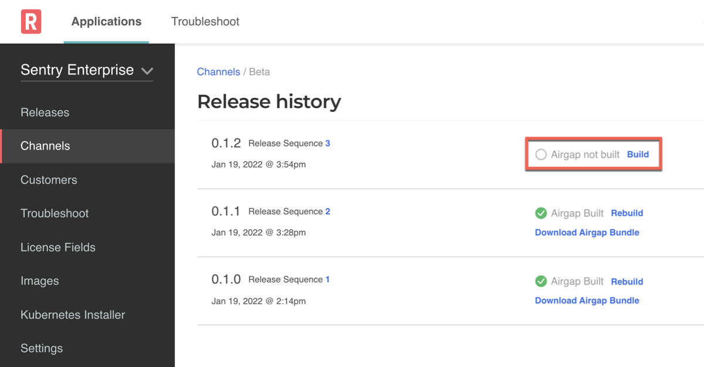

# Using Image Tags and Digests

This topic describes using image tags and digests with your application images. It includes information about when image tags and digests are supported, and how to enable support for image digests in air gap bundles.

## Support for Image Tags and Digests

The following table describes the use cases in which image tags and digests are supported:

<table>
  <tr>
    <th width="10%">Installation</th>
    <th width="30%">Support for Image Tags</th>
    <th width="30%">Support for Image Digests</th>
  </tr>
  <tr>
    <td>Online</td>
    <td>Supported by default</td>
    <td>Supported by default</td>
  </tr>
  <tr>
    <td>Air Gap</td>
    <td>Supported by default for Replicated KOTS installations</td>
    <td>
    <p>Supported for applications on KOTS v1.82.0 and later when the <b>Enable new air gap bundle format</b> toggle is enabled on the channel.</p>
    <p>For more information, see <a href="#digests-air-gap">Using Image Digests in Air Gap Installations</a> below.</p>
    </td>
  </tr>
</table>

:::note
You can use image tags and image digests together in any case where both are supported.
:::

## Using Image Digests in Air Gap Installations {#digests-air-gap}

For applications installed with KOTS v1.82.0 or later, you can enable a format for air gap bundles that supports the use of image digests. This air gap bundle format also ensures that identical image layers are not duplicated, resulting in a smaller air gap bundle size.

You can enable or disable this air gap bundle format using the **Enable new air gap bundle format** toggle in the settings for any channel in the Vendor Portal. The **Enable new air gap bundle format** toggle is enabled by default.

When you enable **Enable new air gap bundle format** on a channel, all air gap bundles that you build or rebuild on that channel use the updated air gap bundle format.

If users on a version of KOTS earlier than v1.82.0 attempt to install or upgrade an application with an air gap bundle that uses the **Enable new air gap bundle format** format, then the Admin Console displays an error message when they attempt to upload the bundle.

To enable the new air gap bundle format on a channel:

1. In the Replicated [Vendor Portal](https://vendor.replicated.com/channels), go to the Channels page and click the edit icon in the top right of the channel where you want to use the new air gap bundle format.
1. Enable the **Enable new air gap bundle format** toggle.
1. (Recommended) To prevent users on a version of KOTS earlier than v1.82.0 from attempting to upgrade with an air gap bundle that uses the new air gap bundle format, set `minKotsVersion` to "1.82.0" in the Application custom resource manifest file.

   `minKotsVersion` defines the minimum version of KOTS required by the application release. Including `minKotsVersion` displays a warning in the Admin Console when users attempt to install or upgrade the application if they are not on the specified minimum version or later. For more information, see [Setting Minimum and Target Versions for KOTS](packaging-kots-versions).

   **Example**:

   ```yaml
   apiVersion: kots.io/v1beta1
   kind: Application
   metadata:
     name: my-application
   spec:
     ...
     minKotsVersion: "1.82.0"
     ...
   ```

1. Test your changes:
   1. Save and promote the release to a development environment.
   1. On the channel where you enabled **Enable new air gap bundle format**, click **Release history**. On the Release History page, click **Build** next to the latest release to create an air gap bundle with the new format.

      

   1. Click **Download Airgap Bundle**.
   1. Install or upgrade the application with version 1.82.0 or later of the Admin Console or the KOTS CLI. Upload the new air gap bundle to confirm that the installation or upgrade completes successfully.