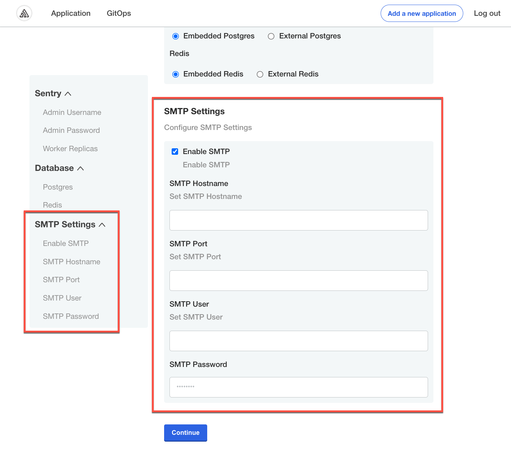

# Creating and Editing Configuration Fields

This topic describes how to use the Config custom resource manifest file to add and edit fields in the Replicated admin console configuration screen. For more information about the configuration screen, see [About the Configuration Screen](config-screen-about).

## Overview of the Config Custom Resource

To include a configuration screen in the Replicated admin console for your application, you add a Config custom resource manifest file to the release in the Replicated vendor portal.

You define the fields that appear on the configuration screen as an array of `groups` and `items` in the Config custom resource manifest:
   * `groups`: A set of `items`. Each group must have a `name`, `title`, `description`, and `items`. For example, you can create a group of several user input fields that are all related to configuring an SMTP mail server.
   * `items`: An array of user input fields. Each array under `items` must have a `name`, `title`, and `type`. You can also include several optional properties. For example, in a group for configuring a SMTP mail server, you can have user input fields under `items` for the SMTP hostname, port, username, and password.

   There are several types of `items` supported in the Config manifest that allow you to collect different types of user inputs. For example, you can use the `password` input type to create a text field on the configuration screen that hides user input.

For more information about the syntax of the Config custom resource manifest, see [Config](../reference/custom-resource-config) in the _Custom Resources_ section.

## Add Fields to the Configuration Screen

Applications can include a configuration screen in the Replicated admin console to collect required or optional values from your users that are used to run your application.

Add and edit fields on the admin console configuration screen by editing the Config custom resource manifest file.

After you create fields in the Config manifest file, you then map the fields to other manifest files in your application to apply the user-supplied values. If you use a Helm chart for your application, you map the fields that you add to the `values.yaml` file. For more information, see [Next Steps](#next-steps) below.

To add fields to the admin console configuration screen:

1. In the [vendor portal](https://vendor.replicated.com/apps), click **Releases**. Then, either click **Create release** to create a new release, or click **Edit YAML** to edit an existing release.
1. Create or open the Config custom resource manifest file in the desired release. A Config custom resource manifest file has `kind: Config`.
1. In the Config custom resource manifest file, define custom user-input fields in an array of `groups` and `items`.

   **Example**:

   ```yaml
   apiVersion: kots.io/v1beta1
   kind: Config
   metadata:
     name: my-application
   spec:
     groups:
       - name: smtp_settings
         title: SMTP Settings
         description: Configure SMTP Settings
         items:
           - name: enable_smtp
             title: Enable SMTP
             help_text: Enable SMTP
             type: bool
             default: "0"
           - name: smtp_host
             title: SMTP Hostname
             help_text: Set SMTP Hostname
             type: text
           - name: smtp_port
             title: SMTP Port
             help_text: Set SMTP Port
             type: text
           - name: smtp_user
             title: SMTP User
             help_text: Set SMTP User
             type: text
           - name: smtp_password
             title: SMTP Password
             type: password
             default: 'password'
   ```

   The example above includes a single group with the name `smtp_settings`.

   The `items` array for the `smtp_settings` group includes the following user-input fields: `enable_smtp`, `smtp_host`, `smtp_port`, `smtp_user`, and `smtp_password`.

   The following screenshot shows how the SMTP Settings group from the example YAML above displays in the admin console configuration screen during application installation:

   

1. (Optional) Add default values for the fields. You can add default values using one of the following properties:
   * **With the `default` property**: When you include the `default` key, the Replicated app manager uses this value when rendering the manifest files for your application. The value then displays as a placeholder on the configuration screen in the admin console for your users. The app manager only uses the default value if the user does not provide a different value.

     :::note
     If you change the `default` value in a later release of your application, installed instances of your application receive the updated value only if your users did not change the default from what it was when they initially installed the application.

     If a user did change a field from its default, the admin console does not overwrite the value they provided.
     :::

   * **With the `value` property**: When you include the `value` key, the app manager does not overwrite this value during an application update. The value that you provide for the `value` key is visually indistinguishable from other values that your user provides on the admin console configuration screen. The app manager treats user-supplied values and the value that you provide for the `value` key as the same.
1. (Optional) Mark fields as required by including `required: true`. When there are required fields, the user is prevented from proceeding with the installation until they provide a valid value for required fields.

   **Example**:

   ```yaml
   - name: smtp_password
     title: SMTP Password
     type: password
     required: true
    ```      

1. Save and promote the release to a development environment to test your changes.

## Next Steps

After you add user input fields to the configuration screen, you use template functions to map the user-supplied values to manifest files in your release. If you use a Helm chart for your application in Replicated, you map the values to the Helm chart `values.yaml` file using the Replicated `HelmChart` custom resource.

For more information, see [Mapping User-Supplied Values](config-screen-map-inputs).
