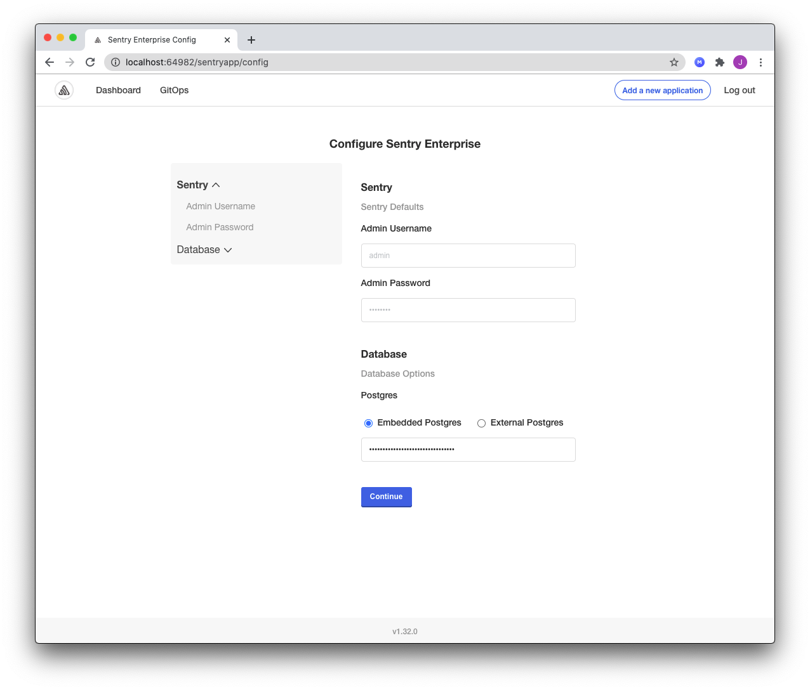

# About the Configuration Screen

Applications can include a configuration screen in the Replicated admin console to collect required or optional values from your users that are used to start your application.

For more information about how to add custom fields to the configuration screen, see [Adding and Editing Configuration Fields](admin-console-customize-config-screen).

If you use a Helm chart for your application in Replicated, your users provide any values specific to their environment from the configuration screen, rather than in the Helm chart `values.yaml` file.

By allowing your users to provide configuration values in the admin console rather than in the Helm `values.yaml` file directly, you can control which options you expose to your users. It also makes it easier for your users to provide their inputs through a user interface, rather than having to edit a YAML file.

For example, you can use the configuration screen to provide database configuration options for your application. Your users could connect your application to an external database by providing required values in the configuration screen, such as the host, port, and a username and password for the database. For a tutorial of this use case, see [Adding Database Configuration Options for your Application](tutorial-adding-db-config).

## Viewing the Configuration Screen

Users of your application can access the configuration screen from the admin console:
* During application installation if you included required fields. See [Application Installation](#application-installation) below.
* At any time after application installation on the Config tab. See [Admin Console Config Tab](#admin-console-config-tab) below.

### Application Installation

If you add any required fields, the admin console displays the configuration screen when the user installs the application, after they upload their license file.

### Admin Console Config Tab

For applications that do not have any required fields, the admin console does not display the configuration screen during application installation.

Regardless of if there are required fields, all users can access the configuration screen any time after they install the application by going to the Config tab in the admin console.

