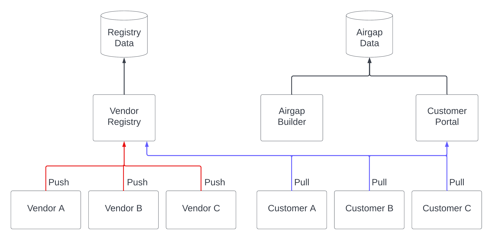

# Data Availability and Continuity

Replicated uses redundancy and a cloud-native architecture in support of availability and continuity of vendor data.

## Data Storage Architecture

To ensure availability and continuity of necessary vendor data, Replicated uses a cloud-native architecture. This cloud-native architecture includes clustering and network redundancies to eliminate single point of failure.

Replicated stores vendor data in various Amazon Web Services (AWS) S3 buckets and multiple databases. Data stored in the AWS S3 buckets includes registry images and air gap build data.

The following diagram shows the flow of air gap build data and registry images from vendors to enterprise customers.

[View a larger version of this image](../../static/images/data-storage.png)

As shown in the diagram above, vendors push application images to an image registry. Replicated stores this registry image data in AWS S3 buckets, which are logically isolated by vendor portal Team. Instances of the vendor's application that are installed by enterprise customers pull data from the image registry.

For more information about how Replicated secures images pushed to the Replicated private registry, see [Replicated Private Registry Security](packaging-private-registry-security).

The diagram also shows how enterprise customers access air gap build data from the customer download portal. Replicated stores this air gap build data in AWS S3 buckets.

## Data Recovery

Our service provider's platform automatically restores customer applications and databases in the case of an outage. The provider's platform is designed to dynamically deploy applications within its cloud, monitor for failures, and recover failed platform components including customer applications and databases.

For more information, see the [Replicated Security White Paper](https://www.replicated.com/downloads/Replicated-Security-Whitepaper.pdf).

## Data Availability

Replicated availability is continuously monitored. For availability reports, see https://status.replicated.com.

## Offsite Data Backup Add-on

For additional data redundancy, an offsite data backup add-on is available to copy customers data to a separate cloud provider. This add-on mitigates against potential data loss by our primary service provider. For more information, see [Offsite Data Backup](offsite-backup).
