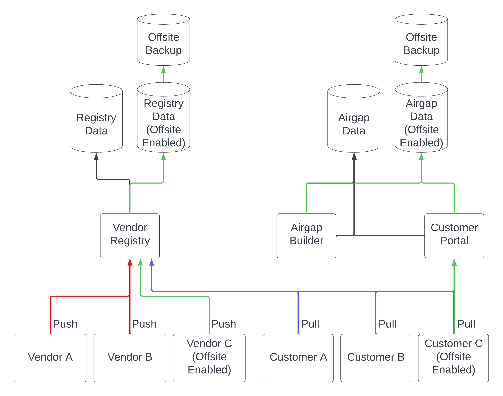

# Offsite Data Backup

Replicated stores customer data in multiple databases across Amazon Web
Services (AWS) S3 buckets. Clustering and network redundancies help to avoid a
single point of failure.

The offsite data backup add-on provides additional redundancy by copying data to
an offsite Google Cloud Provider (GCP) storage location. This helps to mitigate
any potential data loss caused by an outage to AWS.

:::note
The offsite data backup add-on is available only to [Replicated Enterprise](https://www.replicated.com/pricing/) customers at an additional cost. Please contact your customer success representative if you are interested in this feature. 
:::

## Overview

When the offsite data backup add-on is enabled, data is migrated from Replicated's existing AWS S3 buckets to a dedicated second set of AWS S3 buckets. These buckets are only used for vendors with this add-on enabled, and all vendor data remains logically isolated by vendor Team. After data is migrated from existing S3 buckets to the secondary buckets,
all data is deleted from the original S3 buckets.

To ensure customer data in the offsite GCP storage remains up-to-date, the GCP
account uses the Google Storage Transfer service to synchronize at least daily with the
secondary dedicated S3 buckets.

The offsite GCP data backup functions only as secondary data storage and does not serve customer
data. Customer data continues to be served from the AWS S3 buckets. In the case of an AWS outage, Replicated can use a manual
process to restore customer data from the GCP backups into a production-grade database.

For more information, see [Architecture](#architecture) below.

## Architecture

The following diagram shows the flow of air gap build data and registry image data
when the offsite data backup add-on is enabled. The flow of data that is backed
up offsite in GCP is depicted with green arrows.

[View a larger version of this image](../../static/images/offsite-backup.png)

As shown in the diagram above, when the offsite data backup add-on is enabled,
registry and air gap data are stored in dedicated S3 buckets. Both of
these dedicated S3 buckets back up data to offsite storage in GCP.

The diagram also shows how customer installations continue to pull data from the
vendor registry and the customer portal when offsite data backup is enabled.
