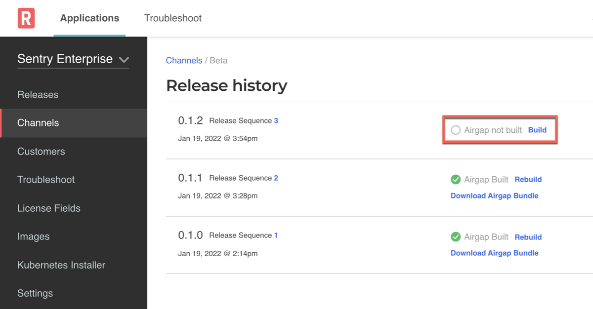

# Connecting to an Image Registry

When packaging and delivering an application with Replicated, you can include private
images for the application without distributing registry credentials
to your customer.

The customer license file can grant revokable image pull access to private images,
whether the images are stored in the Replicated private registry or a supported
external registry.

For information about how to connect to private image registries, see the following procedures:

* [About Connecting to an External Registry](#about-connecting-to-an-external-registry)
* [Push Images to the Replicated Private Registry](#push-images-to-the-replicated-private-registry)
* [Using Private Registries for helm CLI Installations (Beta)](helm-image-registry)

If you use the Replicated private registry or proxy service, you can configure custom domains to alias registry.replicated.com and proxy.replicated.com, to remove the Replicated domains from a customer security review and reduce exposure. This feature is configured at the Team level. For more information about custom domains, see [Using Custom Domains](custom-domains).

## About Connecting to an External Registry

If your application images are available in a private image registry exposed to the Internet, such as Docker Hub, quay.io, Amazon Elastic Container Registry (ECR), Google Container Registry (GCR), or Artifactory, then the customer licenses for your application can grant proxy, or _pull-through_, access to the assignee without exposing registry credentials to the customer.

With proxy access, the app manager can use the Replicated registry proxy service to pull private images from an external registry. Instances of your application can then pull private images from the proxy service at `proxy.replicated.com` during deployment. The app manager determines what images are private by attempting to fetch image metadata. If the request is forbidden, the app manager pulls the image through `proxy.replicated.com` instead of pulling the image directly from an external registry.

Connecting the app manager to your external registry through a proxy is useful and recommended because it prevents you from having to modify the process you use to build and push application images in order to deploy your application with Replicated.

It also allows you to revoke a customer’s ability to pull private images without having to manage image access through separate identity or authentication systems. For example, when you connect the app manager to your external image registry, a customer's ability to pull private images is revoked when their trial license expires.

To grant proxy access to your external registry, see [Configure Access to an External Registry](#configure-access-to-an-external-registry) below.

The following diagram demonstrates how the registry proxy service pulls images from your external registry, and how deployed instances of your application pull images from the proxy service:


[View a larger version of this image](/images/private-registry-diagram-large.png)

For more information about how the app manager uses the registry proxy service, see [How the App Manager Accesses Private Images](#how-the-app-manager-accesses-private-images) below.

## Configure Access to an External Registry

You can provide the credentials for an external registry in the vendor portal to
grant the app manager proxy access to the private application images in the
registry.

All applications in your vendor portal Team have access to the external registry
that you add. This means that you can use the images in the external registry across
multiple apps in the Team.

To follow a tutorial connecting a sample app to an Amazon Elastic Container Registry (ECR), see [Tutorial: Using ECR for Private Images](tutorial-ecr-private-images).

To configure access to your private images in an external registry using the vendor portal:

1. Log in to the [vendor portal](https://vendor.replicated.com) and go to the Images page.
1. Click **Add external registry**.

   

1. Click the **Other Registry** or **DockerHub** tab.
1. Complete the fields in the dialog:
<table>
  <tr>
    <th width="30%">Field</th>
    <th width="70%">Instructions</th>
  </tr>
  <tr>
    <td>Endpoint</td>
    <td>Enter the endpoint, such as quay.io, index.docker.io, or gcr.io.</td>
  </tr>
  <tr>
    <td>Username and Password</td>
    <td>Provide the username and password for an account that has pull access to the private registry.<br/><br/>For Amazon ECR registries, provide the Access Key ID and Secret Key for a Service Account User that has pull access to the registry. See <a href="tutorial-ecr-private-images#setting-up-the-service-account-user">Setting up the Service Account User</a>.<br/><br/>Replicated stores your username and password encrypted and securely. Your credentials and the encryption key do not leave Replicated servers.</td>
  </tr>
</table>

To configure access to private images in an external registry using the Replicated CLI:

1. Follow the instructions to [install and configure](/reference/replicated-cli-installing) the Replicated CLI.
1. Add a registry using the following command:

```bash
replicated registry add <hostname> \
    --username <username> \
    --password <password>
```

To prevent the password from being saved in your shell history, we recommend using the `--password-stdin` flag and entering the password when prompted.

## Test External Registry Credentials

There are a lot of variables when configuring access to an external registry that could prevent it from working if not properly set up. To help understand these early, the Replicated CLI has support to validate that the configured registry can pull specific images:

```bash
replicated registry test <hostname> \
    --image <imagename>
```

This will ensure that the the saved credentials on our servers can pull the image specified in `imagename`.

For example:

```bash
replicated registry test index.docker.io my-company/my-image:v1.2.3
```


## Push Images to the Replicated Private Registry

You can host the private images for your application on the Replicated private registry. Hosting your images on the Replicated private registry is useful if you do not already have your images in an existing private registry. It is also useful for testing purposes.

For more information about building, tagging, and pushing Docker images, see the
[Docker CLI documentation](https://docs.docker.com/engine/reference/commandline/cli/).

To push images to the Replicated private registry:

1. Do one of the following to connect with the `registry.replicated.com` container registry:
   * **(Recommended) Log in with a user token**: Use `docker login registry.replicated.com` with your vendor portal email as the username and a vendor portal user token as the password. For more information, see [User tokens](../reference/replicated-cli-tokens#user-tokens) in _Using Vendor API tokens_.
   * **Log in with a service account or team token**: Use `docker login registry.replicated.com` with a Replicated vendor portal service account or team token as the password. You can use any string as the username. For more information, see [Service accounts](../reference/replicated-cli-tokens#service-accounts) and [Team tokens](../reference/replicated-cli-tokens#team-tokens) in _Using Vendor API tokens_.
   * **Log in with your credentials**: Use `docker login registry.replicated.com` with your vendor portal email and password as the credentials.

1. Tag your private image with the Replicated registry hostname in the standard
Docker format:

   ```
   docker tag IMAGE_NAME registry.replicated.com/APPLICATION_SLUG/TARGET_IMAGE_NAME:TAG
   ```

   Where:
   * `IMAGE_NAME` is the name of the existing private image for your application.
   * `APPLICATION_SLUG` is the slug assigned to your application. You can find your application slug on the **Images** page of the vendor portal.
   * `TARGET_IMAGE_NAME` is a name for the image. Replicated recommends that the `TARGET_IMAGE_NAME` is the same as the `IMAGE_NAME`.
   * `TAG` is a tag for the image.

   For example:

   ```shell
   $ docker tag worker registry.replicated.com/myapp/worker:1.0.1
   ```

1. Push your private image to the Replicated private registry:
  ```shell
  $ docker push registry.replicated.com/APPLICATION_SLUG/TARGET_IMAGE_NAME:TAG
  ```

## How the App Manager Accesses Private Images

The app manager uses Kustomize to change the location of the private image registry
in the PodSpec during application deployment from the external registry domain to
the Replicated proxy service domain.
It then creates an `imagePullSecret` to access the images through the proxy service.

### Patching the Image Location with Kustomize

When the app manager is installing an application, it attempts to load image manifests
using the image reference from the PodSpec. If the app manager receives a 401 response,
it assumes that this is a private image that must be proxied through the
registry proxy service.

The app manager uses Kustomize to patch the `midstream/kustomization.yaml` file to change the image name during deployment to reference the proxy service.

For example, a PodSpec for a Deployment references a private image hosted at `quay.io/my-org/api:v1.0.1`:

```yaml
  apiVersion: apps/v1
  kind: Deployment
  metadata:
    name: example
  spec:
    template:
      spec:
        containers:
          - name: api
            image: quay.io/my-org/api:v1.0.1
```

When this application is deployed, the app manager detects that it cannot access
the image at quay.io. So, it creates a patch in the `midstream/kustomization.yaml`
file that changes the image name in all manifest files for the application:

```yaml
  apiVersion: kustomize.config.k8s.io/v1beta1
  bases:
  - ../../base
  images:
  - name: quay.io/my-org/api:v1.0.1
    newName: proxy.replicated.com/proxy/my-kots-app/quay.io/my-org/api
```

This causes the container runtime in the cluster to use the proxy service to pull the images,
using the license information provided to the app manager for authentication.


### Accessing the Proxy Service with an Image Pull Secret

During installation, the app manager automatically creates an `imagePullSecret`
that is based on the customer license. The app manager uses this secret to authenticate and
pull private images from `proxy.replicated.com`.

The app manager does not patch the image location URL for images hosted on the Replicated private registry
at `registry.replicated.com`. However, the app manager adds the same `imagePullSecret` to
PodSpecs that reference images in the Replicated private registry.

:::note
When deploying Pods to namespaces other than the app manager application namespace, you must add the namespace to the `additionalNamespaces` attribute of the Application custom resource manifest.
This ensures the app manager can provision the `imagePullSecret` in the namespace to allow the Pod to pull the image.
For more information about the `additionalNamespaces` attribute, see [Defining Additional Namespaces](operator-defining-additional-namespaces).
:::


## Using Image Tags and Digests

This section describes using image tags and digests with your application images. It includes information about when image tags and digests are supported, and how to enable support for image digests in air gap bundles.

### Support for Image Tags and Digests

The following table describes the use cases in which image tags and digests are supported:

<table>
  <tr>
    <th width="10%">Installation</th>
    <th width="30%">Support for Image Tags</th>
    <th width="30%">Support for Image Digests</th>
  </tr>
  <tr>
    <td>Online</td>
    <td>Supported by default</td>
    <td>Supported by default</td>
  </tr>
  <tr>
    <td>Air Gap</td>
    <td>Supported by default</td>
    <td>
    <p>Supported for applications on the app manager v1.82.0 and later when the <b>Enable new air gap bundle format</b> toggle is enabled on the channel.</p>
    <p>For more information, see <a href="#digests-air-gap">Using Image Digests in Air Gap Installations</a> below.</p>
    </td>
  </tr>
</table>

:::note
You can use image tags and image digests together in any case where both are supported.
:::

### Using Image Digests in Air Gap Installations {#digests-air-gap}

For applications installed with the app manager v1.82.0 or later, you can enable a format for air gap bundles that supports the use of image digests. This air gap bundle format also ensures that identical image layers are not duplicated, resulting in a smaller air gap bundle size.

You can enable or disable this air gap bundle format using the **Enable new air gap bundle format** toggle in the settings for any channel in the vendor portal. The **Enable new air gap bundle format** toggle is enabled by default.

When you enable **Enable new air gap bundle format** on a channel, all air gap bundles that you build or rebuild on that channel use the updated air gap bundle format.

If users on a version of the app manager earlier than v1.82.0 attempt to install or upgrade an application with an air gap bundle that uses the **Enable new air gap bundle format** format, then the admin console displays an error message when they attempt to upload the bundle.

To enable the new air gap bundle format on a channel:

1. In the Replicated [vendor portal](https://vendor.replicated.com/channels), go to the Channels page and click the edit icon in the top right of the channel where you want to use the new air gap bundle format.
1. Enable the **Enable new air gap bundle format** toggle.
1. (Recommended) To prevent users on a version of the app manager earlier than v1.82.0 from attempting to upgrade with an air gap bundle that uses the new air gap bundle format, set `minKotsVersion` to "1.82.0" in the Application custom resource manifest file.

   `minKotsVersion` defines the minimum version of the app manager required by the application release. Including `minKotsVersion` displays a warning in the admin console when users attempt to install or upgrade the application if they are not on the specified minimum version or later. For more information, see [Setting Minimum and Target Versions for KOTS](packaging-kots-versions).

   **Example**:

   ```yaml
   apiVersion: kots.io/v1beta1
   kind: Application
   metadata:
     name: my-application
   spec:
     ...
     minKotsVersion: "1.82.0"
     ...
   ```

1. Test your changes:
   1. Save and promote the release to a development environment.
   1. On the channel where you enabled **Enable new air gap bundle format**, click **Release history**. On the Release History page, click **Build** next to the latest release to create an air gap bundle with the new format.

      

   1. Click **Download Airgap Bundle**.
   1. Install or upgrade the application with version 1.82.0 or later of the admin console or the kots CLI. Upload the new air gap bundle to confirm that the installation or upgrade completes successfully.

## Related Topic

[Tutoiral: Using ECR for Private Images](tutorial-ecr-private-images)
